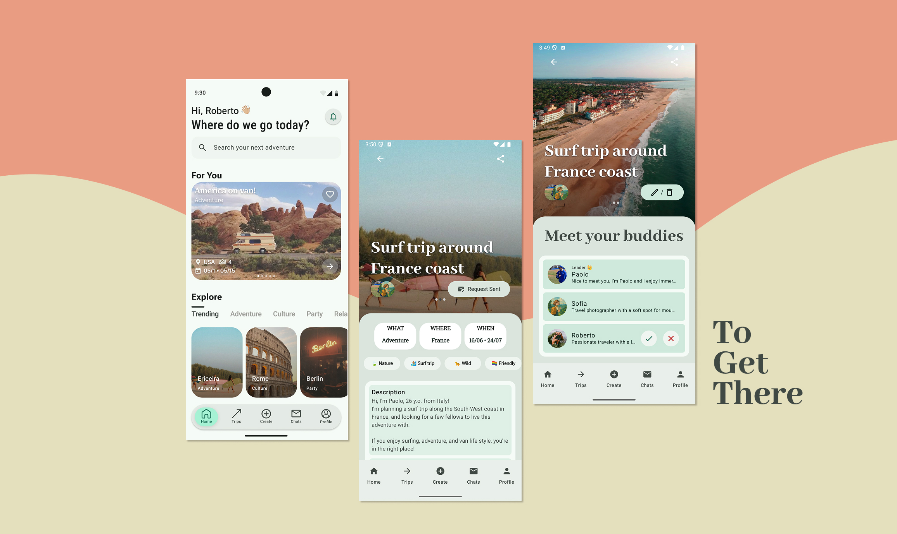

# 🌍 ToGetThere

A modern **Android mobile application** designed to **organize group trips** and **connect travelers** with shared interests.

Users can discover adventures, create trips, join groups, chat with participants, and manage travel requests – all in one place.

This project was developed as part of an academic and personal exploration of mobile applications development and UX/UI design. Thanks to [michepaolo](github.com/michepaolo), [VaglioFabiano](github.com/VaglioFabiano) and [villanovafrancesca](github.com/villanovafrancesca) for their contributions.

## 🧩 Tech Stack

- 🤖 **Android**
- 💙 **Kotlin**
- 🧱 **Jetpack Compose**
- 🏗 **MVVM Architecture**
- 🔥 **Firebase**

---

## 🧭 How It Works

1. Users browse trips from the **Home feed**
2. They can filter by **category** (Adventure, Culture, Party, Relax...)
3. Each trip has a **detail page** with:
   - Images
   - Location
   - Dates
   - Tags
   - Description
   - Participants list
4. Users can **send join requests** to trip leaders
5. Leaders can **accept or reject** participants
6. Once approved, users can **chat** with the group
7. Everyone can **create their own trip** and become a leader

---
